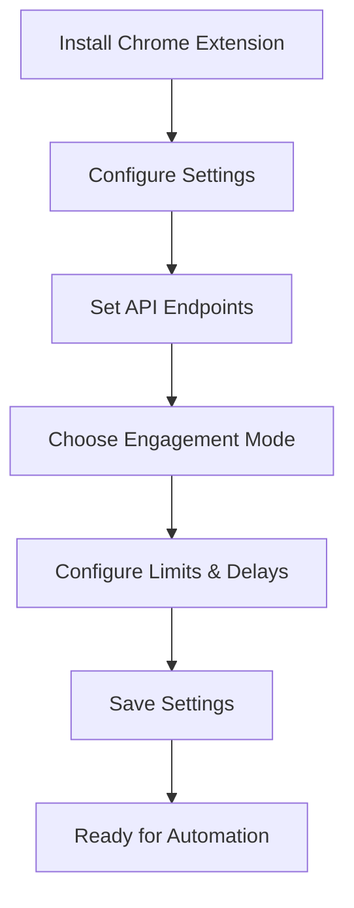
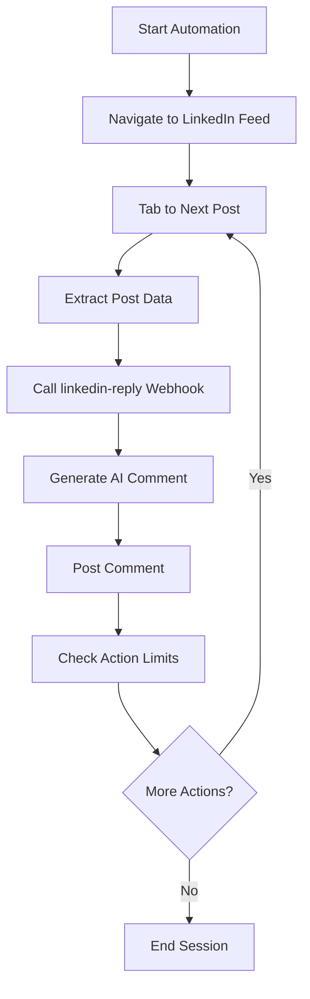
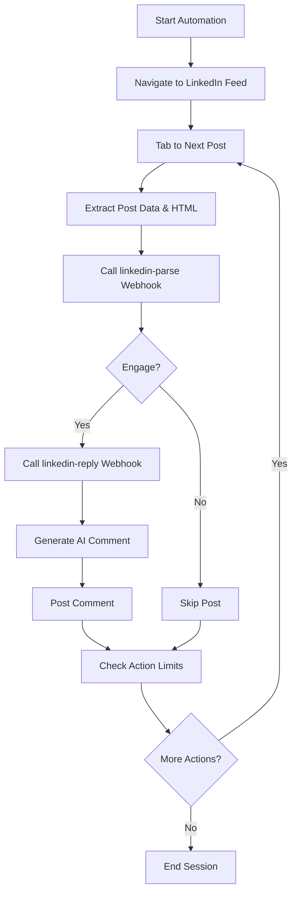
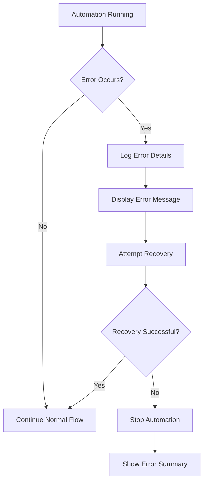

# LinkRight - LinkedIn Automation Platform
## Complete Product Documentation

---

## 📋 **TABLE OF CONTENTS**

1. [Project Overview](#project-overview)
2. [Mission & Vision](#mission--vision)
3. [Core Functionalities](#core-functionalities)
4. [User Flows](#user-flows)
5. [Technical Architecture](#technical-architecture)
6. [File Structure](#file-structure)
7. [Installation & Setup](#installation--setup)
8. [Configuration](#configuration)
9. [API Documentation](#api-documentation)
10. [Development Guide](#development-guide)
11. [Performance Optimizations](#performance-optimizations)
12. [Troubleshooting](#troubleshooting)
13. [Contributing](#contributing)

---

## 🎯 **PROJECT OVERVIEW**

**LinkRight** is an intelligent LinkedIn automation platform designed to streamline professional networking and job search activities. It combines AI-powered content generation with sophisticated automation to help users engage meaningfully on LinkedIn while maintaining authenticity and compliance.

### **What LinkRight Does:**

- **Automates LinkedIn engagement** (comments, likes, connections)
- **Generates AI-powered responses** using advanced language models
- **Provides intelligent filtering** to engage with relevant content
- **Maintains human-like behavior** with randomized delays and patterns
- **Offers dual engagement modes** (Default and Optimized)
- **Tracks performance metrics** and session analytics

### **Target Users:**

- **Job seekers** looking to expand their professional network
- **Sales professionals** building relationships with prospects
- **Content creators** seeking meaningful engagement
- **Business development** teams scaling outreach efforts
- **Recruiters** sourcing and connecting with candidates

---

## 🚀 **MISSION & VISION**

### **Mission Statement**
"Democratize professional networking by making meaningful LinkedIn engagement accessible, efficient, and authentic for everyone."

### **Vision Statement**
"To become the leading platform that transforms how professionals build relationships and advance their careers through intelligent automation."

### **Core Values**
- **Authenticity**: Maintain human-like engagement patterns
- **Efficiency**: Maximize networking impact with minimal time investment
- **Compliance**: Respect LinkedIn's terms of service and platform guidelines
- **Transparency**: Provide clear insights into automation activities
- **Accessibility**: Make professional networking tools available to everyone

---

## ⚡ **CORE FUNCTIONALITIES**

### **1. Dual Engagement Modes**

#### **Default Mode (Optimize Engagement: OFF)**
- **Behavior**: Comments on every post encountered
- **Use Case**: Maximum reach and visibility
- **Workflow**: 
  1. Navigate through LinkedIn feed using Tab key
  2. Extract post data (ID, content, author)
  3. Call `linkedin-reply` webhook for AI comment generation
  4. Post the generated comment
  5. Continue to next post

#### **Optimized Mode (Optimize Engagement: ON)**
- **Behavior**: Selective engagement based on post analysis
- **Use Case**: Quality over quantity, strategic networking
- **Workflow**:
  1. Navigate through LinkedIn feed using Tab key
  2. Extract post data (ID, content, author, full HTML)
  3. Call `linkedin-parse` webhook for engagement decision
  4. If `{"engage": "yes"}`: Call `linkedin-reply` webhook and post comment
  5. If `{"engage": "no"}`: Skip post and continue
  6. Move to next post

### **2. AI-Powered Comment Generation**

#### **Webhook Integration**
- **`linkedin-reply`**: Generates contextual, professional comments
- **`linkedin-parse`**: Analyzes posts and determines engagement worthiness
- **Payload**: Includes post ID, content, and author information
- **Response**: Returns AI-generated comment or engagement decision

#### **Comment Quality Features**
- **Contextual**: Comments are relevant to post content
- **Professional**: Maintains appropriate tone and language
- **Varied**: Avoids repetitive patterns
- **Authentic**: Mimics human engagement behavior

### **3. Smart Navigation System**

#### **Pure Tab Navigation**
- **Method**: Uses only Tab key for navigation (no shortcuts)
- **Reliability**: Works consistently across different LinkedIn layouts
- **Accessibility**: Compatible with screen readers and assistive technologies
- **Pattern**: Sequential tabbing through post elements

#### **Post Detection**
- **Strategy**: Identifies posts by `div[data-id]` attributes
- **Extraction**: Captures complete post HTML for analysis
- **Validation**: Ensures correct post targeting before engagement

### **4. Session Management & Analytics**

#### **Session Tracking**
- **Duration**: Configurable session length (default: 3 minutes)
- **Actions**: Tracks comments posted, posts analyzed
- **Metrics**: Records engagement rates and success statistics
- **State**: Maintains session state across page refreshes

#### **Performance Monitoring**
- **Real-time Stats**: Live updates during automation
- **Error Tracking**: Logs and reports automation issues
- **Success Rates**: Measures engagement effectiveness
- **Health Checks**: Monitors system status and connectivity

---

## 🔄 **USER FLOWS**

### **Flow 1: Initial Setup**



### **Flow 2: Default Mode Automation**



### **Flow 3: Optimized Mode Automation**



### **Flow 4: Error Handling**



---

## 🏗️ **TECHNICAL ARCHITECTURE**

### **System Components**

#### **1. Chrome Extension (Frontend)**
- **Manifest**: V3 compliant
- **Content Script**: UI injection and DOM manipulation
- **Background Script**: API communication and state management
- **Storage**: Local settings persistence

#### **2. Node.js Backend (Runner)**
- **Framework**: Express.js server
- **Automation**: Playwright for browser control
- **Browser**: Chromium with LinkedIn integration
- **API**: RESTful endpoints for extension communication

#### **3. External Webhooks**
- **`linkedin-reply`**: AI comment generation service
- **`linkedin-parse`**: Post analysis and engagement decision service
- **Integration**: HTTP requests with JSON payloads

### **Architecture Diagram**

```
┌─────────────────┐    ┌─────────────────┐    ┌─────────────────┐
│   Chrome        │    │   Node.js       │    │   External      │
│   Extension     │◄──►│   Backend       │◄──►│   Webhooks      │
│                 │    │   (Runner)      │    │                 │
│ • content.js    │    │ • Express API   │    │ • linkedin-     │
│ • background.js │    │ • Playwright   │    │   reply         │
│ • sidebar UI    │    │ • Chromium      │    │ • linkedin-     │
└─────────────────┘    └─────────────────┘    │   parse         │
                                               └─────────────────┘
```

### **Data Flow**

1. **User Interaction**: Extension UI captures user settings
2. **Settings Storage**: Chrome storage API persists configuration
3. **API Communication**: Extension sends settings to backend
4. **Browser Automation**: Playwright controls Chromium browser
5. **Post Analysis**: Backend extracts post data and HTML
6. **Webhook Integration**: External services analyze and generate content
7. **Engagement**: Automated posting of AI-generated comments
8. **Session Tracking**: Real-time metrics and state management

---

## 📁 **FILE STRUCTURE**

```
linkright-extension/
├── manifest.json                 # Chrome extension manifest
├── content.js                   # Content script (UI injection)
├── background.js               # Service worker (API communication)
├── sidebar.css                  # Extension styling
├── config.js                   # Configuration constants
├── runner-control.js          # Runner control utilities
│
├── linkright-runner/           # Node.js backend
│   ├── server/
│   │   ├── index.js            # Express server
│   │   ├── playwright-runner.js # Browser automation
│   │   ├── auth.js             # Authentication
│   │   └── logger.js           # Logging utilities
│   ├── package.json            # Dependencies
│   ├── README.md               # Runner documentation
│   └── logs/                   # Log files
│
├── icons/                      # Extension icons
│   ├── icon16.png
│   ├── icon48.png
│   ├── icon128.png
│   └── generate-icons.js       # Icon generation script
│
├── tests/                      # Test files
│   ├── e2e/                    # End-to-end tests
│   └── toLinkedInUrl.test.js   # Unit tests
│
└── docs/                      # Documentation
    ├── linkedin/
    │   └── Runbook.md          # LinkedIn-specific guides
    └── reference/
        └── URL_conversion.md   # URL conversion logic
```

### **Key Files Description**

#### **Frontend Files**
- **`manifest.json`**: Chrome extension configuration
- **`content.js`**: Main UI logic and user interactions
- **`background.js`**: API communication and state management
- **`sidebar.css`**: Complete styling for the extension UI

#### **Backend Files**
- **`server/index.js`**: Express API server with endpoints
- **`server/playwright-runner.js`**: Core automation engine
- **`server/auth.js`**: Authentication and security
- **`server/logger.js`**: Logging and debugging utilities

#### **Configuration Files**
- **`config.js`**: Application constants and settings
- **`runner-control.js`**: Runner control and management utilities

---

## 🚀 **INSTALLATION & SETUP**

### **Prerequisites**

- **Google Chrome** (version 88+)
- **Node.js** (version 16+)
- **npm** (version 8+)
- **Active LinkedIn account**
- **Webhook endpoints** (for AI services)

### **Installation Steps**

#### **1. Clone Repository**
```bash
git clone https://github.com/your-username/linkright-extension.git
cd linkright-extension
```

#### **2. Install Dependencies**
```bash
# Install backend dependencies
cd linkright-runner
npm install

# Return to root directory
cd ..
```

#### **3. Configure Extension**
```bash
# Update manifest.json with your details
# Set correct webhook URLs in config.js
# Configure API endpoints in background.js
```

#### **4. Load Extension in Chrome**
1. Open Chrome and go to `chrome://extensions/`
2. Enable "Developer mode"
3. Click "Load unpacked"
4. Select the extension directory
5. Verify extension appears in toolbar

#### **5. Start Backend Server**
```bash
cd linkright-runner
npm start
```

#### **6. Configure Settings**
1. Click extension icon in Chrome toolbar
2. Go to Settings tab
3. Configure API endpoints and webhooks
4. Set engagement mode and limits
5. Save settings

### **Verification Steps**

1. **Extension Loaded**: Icon appears in Chrome toolbar
2. **Backend Running**: Server responds on configured port
3. **Settings Saved**: Configuration persists across sessions
4. **Webhook Access**: External services are reachable
5. **LinkedIn Access**: Can navigate to LinkedIn feed

---

## ⚙️ **CONFIGURATION**

### **Extension Settings**

#### **Core Settings**
- **Runner Base URL**: Backend server endpoint
- **API Token**: Authentication token for backend
- **Webhook URL**: AI comment generation endpoint
- **Privacy Policy URL**: Legal compliance link

#### **Engagement Settings**
- **Optimize Engagement**: Toggle between Default and Optimized modes
- **Post Analysis Webhook**: URL for post analysis service
- **Max Actions**: Maximum comments per session
- **Session Duration**: Automation session length

#### **Timing Settings**
- **Action Delay**: Time between actions (3-7 seconds)
- **Navigation Delay**: Time between tab navigation (1-3 seconds)
- **Webhook Timeout**: Timeout for external API calls (10 seconds)
- **Recovery Delay**: Time before retry on errors (5-10 seconds)

### **Backend Configuration**

#### **Server Settings**
```javascript
const config = {
  port: process.env.PORT || 3001,
  host: process.env.HOST || '127.0.0.1',
  headless: process.env.HEADLESS === 'true',
  maxComments: process.env.MAX_COMMENTS || 50
};
```

#### **Browser Settings**
```javascript
const browserConfig = {
  headless: false,
  args: [
    '--no-sandbox',
    '--disable-setuid-sandbox',
    '--disable-dev-shm-usage',
    '--disable-web-security',
    '--disable-features=VizDisplayCompositor'
  ]
};
```

### **Webhook Configuration**

#### **linkedin-reply Webhook**
```json
{
  "url": "https://your-webhook.com/linkedin-reply",
  "method": "POST",
  "headers": {
    "Content-Type": "application/json",
    "x-runner-token": "your-auth-token"
  },
  "payload": {
    "postId": "urn:li:activity:1234567890",
    "postContent": "Post text content...",
    "author": "Author name"
  }
}
```

#### **linkedin-parse Webhook**
```json
{
  "url": "https://your-webhook.com/linkedin-parse",
  "method": "POST",
  "headers": {
    "Content-Type": "application/json"
  },
  "payload": {
    "postId": "urn:li:activity:1234567890",
    "postContent": "Post text content...",
    "postHtml": "<div data-id='...'>...</div>",
    "author": "Author name"
  }
}
```

---

## 🔌 **API DOCUMENTATION**

### **Backend API Endpoints**

#### **POST /api/runner/start-keyboard**
Starts the keyboard automation process.

**Request Body:**
```json
{
  "optimizeEngagement": true,
  "postAnalysisWebhook": "https://n8n.linkright.in/webhook/linkedin-parse",
  "webhookUrl": "https://your-webhook.com/linkedin-reply",
  "maxActions": 50,
  "delays": {
    "actionDelay": 5000,
    "navigationDelay": 2000
  }
}
```

**Response:**
```json
{
  "success": true,
  "message": "Keyboard automation started",
  "mode": "Optimized",
  "sessionId": "session-1234567890"
}
```

#### **POST /api/runner/stop**
Stops the automation process.

**Response:**
```json
{
  "success": true,
  "message": "Automation stopped",
  "sessionStats": {
    "actionsPerformed": 15,
    "postsAnalyzed": 20,
    "successRate": 0.75
  }
}
```

#### **GET /api/runner/status**
Gets current automation status.

**Response:**
```json
{
  "running": true,
  "mode": "Optimized",
  "sessionId": "session-1234567890",
  "actionsPerformed": 15,
  "maxActions": 50,
  "startTime": "2024-01-15T10:30:00Z"
}
```

### **Webhook Integration**

#### **linkedin-reply Webhook**
**Purpose**: Generate AI-powered comments for LinkedIn posts

**Request:**
```json
{
  "postId": "urn:li:activity:1234567890",
  "postContent": "Excited to share our latest product launch...",
  "author": "John Doe"
}
```

**Response:**
```json
{
  "comment": "Congratulations on the launch! This looks like an innovative solution that could really make a difference in the industry.",
  "success": true
}
```

#### **linkedin-parse Webhook**
**Purpose**: Analyze posts and determine engagement worthiness

**Request:**
```json
{
  "postId": "urn:li:activity:1234567890",
  "postContent": "Excited to share our latest product launch...",
  "postHtml": "<div data-id='urn:li:activity:1234567890'>...</div>",
  "author": "John Doe"
}
```

**Response:**
```json
{
  "postId": "urn:li:activity:1234567890",
  "engage": "yes"
}
```

---

## 🛠️ **DEVELOPMENT GUIDE**

### **Development Environment Setup**

#### **1. Prerequisites**
```bash
# Install Node.js (16+)
curl -o- https://raw.githubusercontent.com/nvm-sh/nvm/v0.39.0/install.sh | bash
nvm install 16
nvm use 16

# Install dependencies
npm install -g nodemon
```

#### **2. Backend Development**
```bash
cd linkright-runner
npm install
npm run dev  # Starts with nodemon for auto-restart
```

#### **3. Extension Development**
```bash
# Make changes to content.js, background.js, or sidebar.css
# Reload extension in Chrome (chrome://extensions/)
# Test changes in LinkedIn
```

### **Code Structure**

#### **Frontend Architecture**
```javascript
// content.js - Main UI logic
class LinkRightExtension {
  constructor() {
    this.settings = {};
    this.isRunning = false;
  }
  
  // UI rendering and user interactions
  renderUI() { /* ... */ }
  handleUserActions() { /* ... */ }
  saveSettings() { /* ... */ }
}

// background.js - API communication
class APIClient {
  async sendRequest(endpoint, data) { /* ... */ }
  async startAutomation(settings) { /* ... */ }
  async stopAutomation() { /* ... */ }
}
```

#### **Backend Architecture**
```javascript
// playwright-runner.js - Automation engine
class PlaywrightRunner {
  constructor() {
    this.browser = null;
    this.page = null;
    this.isRunning = false;
  }
  
  async startKeyboardAutomation() { /* ... */ }
  async extractPostData() { /* ... */ }
  async engageWithPost(postData) { /* ... */ }
}
```

### **Testing**

#### **Unit Tests**
```bash
cd tests
npm test
```

#### **End-to-End Tests**
```bash
cd tests/e2e
npx playwright test
```

#### **Manual Testing**
1. Load extension in Chrome
2. Navigate to LinkedIn feed
3. Start automation
4. Verify post detection and engagement
5. Check error handling and recovery

### **Debugging**

#### **Extension Debugging**
```javascript
// Use Chrome DevTools
// Console logs appear in extension context
console.log('Debug info:', data);

// Check background script logs
chrome://extensions/ → Details → Inspect views: background page
```

#### **Backend Debugging**
```javascript
// Server logs
console.log('[INFO]', message);
console.error('[ERROR]', error);

// Browser automation logs
console.log('[PLAYWRIGHT]', action, result);
```

---

## ⚡ **PERFORMANCE OPTIMIZATIONS**

### **Memory Optimizations**

#### **WeakMap Usage**
```javascript
// Efficient object references without memory leaks
const _domCache = new WeakMap();
const _memoizedExtractPostData = new WeakMap();
```

#### **Lazy Loading**
```javascript
// Load resources only when needed
get browser() {
  if (!this._browser) {
    this._browser = await playwright.chromium.launch();
  }
  return this._browser;
}
```

#### **Efficient Data Structures**
```javascript
// O(1) lookups for post tracking
const seenPostIds = new Set();
const postMetrics = new Map();
```

### **DOM Optimizations**

#### **Caching DOM Queries**
```javascript
// Cache frequently accessed elements
const _cachedElements = new WeakMap();
querySelector(selector) {
  if (!this._cachedElements.has(selector)) {
    this._cachedElements.set(selector, document.querySelector(selector));
  }
  return this._cachedElements.get(selector);
}
```

#### **Batch DOM Operations**
```javascript
// Batch updates to reduce reflows
const _pendingUpdates = [];
const _updateTimer = null;

handleDOMUpdates(updates) {
  this._pendingUpdates.push(...updates);
  if (!this._updateTimer) {
    this._updateTimer = setTimeout(() => this.processPendingUpdates(), 16);
  }
}
```

### **Network Optimizations**

#### **Request Batching**
```javascript
// Batch multiple webhook requests
const requestQueue = [];
const batchSize = 5;

async batchWebhookRequests(requests) {
  const batches = this.chunkArray(requests, this.batchSize);
  for (const batch of batches) {
    await this.processBatch(batch);
  }
}
```

#### **Connection Pooling**
```javascript
// Reuse HTTP connections
const keepAliveAgent = new https.Agent({
  keepAlive: true,
  maxSockets: 10
});
```

### **Algorithm Optimizations**

#### **Early Exit Patterns**
```javascript
// Exit early when conditions are met
if (this.actionsPerformed >= this.maxActions) {
  return this.stop();
}
```

#### **Memoization**
```javascript
// Cache expensive computations
const _memoizedExtractPostData = new WeakMap();
extractPostData(postElement) {
  if (this._memoizedExtractPostData.has(postElement)) {
    return this._memoizedExtractPostData.get(postElement);
  }
  const result = this.performExpensiveExtraction(postElement);
  this._memoizedExtractPostData.set(postElement, result);
  return result;
}
```

---

## 🔧 **TROUBLESHOOTING**

### **Common Issues**

#### **1. Extension Not Loading**
**Symptoms**: Extension icon not visible in Chrome toolbar
**Solutions**:
- Check Chrome version (88+ required)
- Verify manifest.json syntax
- Check for JavaScript errors in console
- Reload extension in chrome://extensions/

#### **2. Backend Connection Failed**
**Symptoms**: "Failed to connect to runner" error
**Solutions**:
- Verify backend server is running (`npm start`)
- Check port configuration (default: 3001)
- Ensure firewall allows local connections
- Check CORS settings in server configuration

#### **3. Automation Not Starting**
**Symptoms**: Start button doesn't trigger automation
**Solutions**:
- Check LinkedIn page is loaded completely
- Verify user is logged into LinkedIn
- Check browser console for JavaScript errors
- Ensure webhook URLs are configured correctly

#### **4. Post Detection Issues**
**Symptoms**: Automation skips posts or fails to detect them
**Solutions**:
- Check LinkedIn page structure hasn't changed
- Verify `div[data-id]` selectors are working
- Check for JavaScript errors in automation
- Test with different LinkedIn post types

#### **5. Webhook Timeout Errors**
**Symptoms**: "Webhook timeout" or "Request failed" errors
**Solutions**:
- Check webhook URL is accessible
- Verify network connectivity
- Check webhook response time (should be < 10 seconds)
- Review webhook server logs

### **Debugging Steps**

#### **1. Check Extension Logs**
```javascript
// Open Chrome DevTools
// Go to Console tab
// Look for error messages and warnings
```

#### **2. Check Backend Logs**
```bash
cd linkright-runner
tail -f logs/runner.log
```

#### **3. Test Webhook Connectivity**
```bash
curl -X POST https://your-webhook.com/linkedin-reply \
  -H "Content-Type: application/json" \
  -d '{"postId":"test","postContent":"test"}'
```

#### **4. Verify LinkedIn Access**
- Ensure user is logged into LinkedIn
- Check for any LinkedIn security prompts
- Verify LinkedIn page loads completely

### **Performance Issues**

#### **1. Slow Automation**
**Causes**: Network latency, DOM parsing overhead
**Solutions**:
- Reduce action delays
- Optimize DOM queries
- Use connection pooling
- Implement request batching

#### **2. High Memory Usage**
**Causes**: Memory leaks, inefficient data structures
**Solutions**:
- Use WeakMap for object references
- Implement proper cleanup
- Avoid circular references
- Use efficient data structures

#### **3. Browser Crashes**
**Causes**: Resource exhaustion, infinite loops
**Solutions**:
- Implement proper error handling
- Add timeout mechanisms
- Monitor resource usage
- Implement circuit breakers

---

## 🤝 **CONTRIBUTING**

### **Development Workflow**

#### **1. Fork Repository**
```bash
git clone https://github.com/your-username/linkright-extension.git
cd linkright-extension
git remote add upstream https://github.com/original-repo/linkright-extension.git
```

#### **2. Create Feature Branch**
```bash
git checkout -b feature/your-feature-name
```

#### **3. Make Changes**
```bash
# Make your changes
# Test thoroughly
# Update documentation if needed
```

#### **4. Test Changes**
```bash
# Run unit tests
npm test

# Run e2e tests
npm run test:e2e

# Manual testing
# Load extension and test functionality
```

#### **5. Submit Pull Request**
```bash
git add .
git commit -m "Add your feature"
git push origin feature/your-feature-name
# Create pull request on GitHub
```

### **Code Standards**

#### **JavaScript Style**
```javascript
// Use modern ES6+ features
const config = {
  port: process.env.PORT || 3001,
  host: process.env.HOST || '127.0.0.1'
};

// Use async/await for promises
async function startAutomation() {
  try {
    const result = await this.performAction();
    return result;
  } catch (error) {
    console.error('Error:', error);
    throw error;
  }
}

// Use descriptive variable names
const postAnalysisWebhook = 'https://n8n.linkright.in/webhook/linkedin-parse';
const maxActionsPerSession = 50;
```

#### **Documentation Standards**
- Update README.md for new features
- Add JSDoc comments for functions
- Include usage examples
- Document configuration options

#### **Testing Requirements**
- Unit tests for new functions
- Integration tests for new features
- Manual testing for UI changes
- Performance testing for optimizations

### **Issue Reporting**

#### **Bug Reports**
Include:
- Chrome version and OS
- Extension version
- Steps to reproduce
- Expected vs actual behavior
- Console error messages
- Screenshots if applicable

#### **Feature Requests**
Include:
- Use case description
- Proposed solution
- Benefits to users
- Implementation complexity
- Alternative solutions considered

---

## 📊 **SYSTEM ARCHITECTURE CHANGES**

### **Transition from Old Metrics System**

The platform has evolved from a metrics-based filtering system to a modern AI-powered engagement system:

#### **Old System (Removed)**
- **Metrics Parsing**: Direct DOM scraping for likes, comments, reposts
- **Threshold Filtering**: User-configured minimum engagement requirements
- **Local Decision Making**: Runner-side logic for engagement decisions
- **Complex State Management**: Multiple state variables for metrics tracking

#### **New System (Current)**
- **AI-Powered Analysis**: External webhook handles all post analysis
- **Two-Mode Operation**: Default (aggressive) vs Optimized (selective)
- **Webhook Integration**: `linkedin-parse` for decisions, `linkedin-reply` for comments
- **Simplified Logic**: Runner focuses on navigation and execution

### **Benefits of New Architecture**

1. **Scalability**: External webhooks can handle complex AI analysis
2. **Maintainability**: Business logic separated from automation logic
3. **Flexibility**: Easy to update engagement criteria without code changes
4. **Performance**: Reduced runner complexity and faster execution
5. **Reliability**: External services can be updated independently

### **Removed Components**

The following UI elements and backend code have been removed:
- **UI**: Min reactions, min comments, min reposts input fields
- **Backend**: `meetsThreshold()`, `checkEligibility()` methods
- **Settings**: Old metrics validation and storage
- **Logic**: Direct metrics parsing and comparison

---

## 🎯 **CONCLUSION**

LinkRight represents a significant advancement in LinkedIn automation technology, combining intelligent AI-powered analysis with sophisticated browser automation to create a powerful tool for professional networking.

The platform's dual-mode operation, comprehensive error handling, and performance optimizations make it suitable for both casual users seeking to expand their network and professionals requiring high-volume, strategic engagement.

With its modern architecture, extensive documentation, and commitment to authenticity and compliance, LinkRight is positioned to become the leading solution for LinkedIn automation and professional networking enhancement.

---

**Last Updated**: January 2024  
**Version**: 1.0.0  
**License**: MIT  
**Maintainer**: LinkRight Development Team
